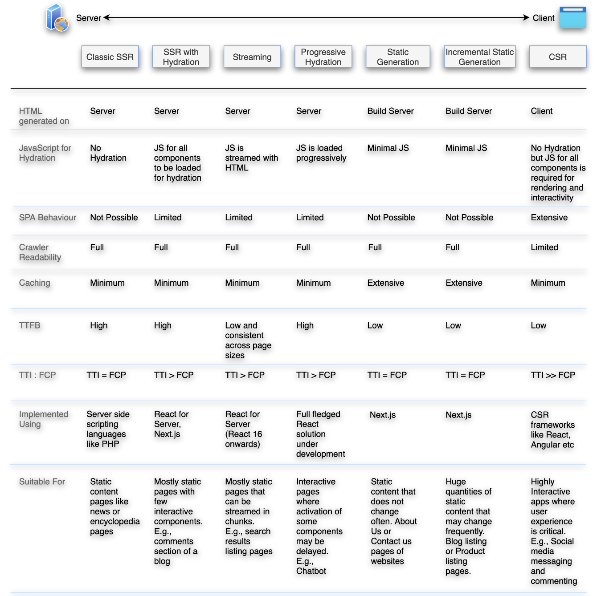

# Rendering

## Types of Rendering

- Client Side Rendering (CSR)
- Static Rendering
- Hydration
- Progressive Rendering
- Server Side Rendering (SSR)

## Info
- Chrome team recommends static rendering or server-side rendering over full rehydration

## Performance Analysis

- **Time to First Byte (TTFB)**
    * the time between clicking a link and the first bit of content coming in.
- **First Paint (FP)**
    * First time any content becomes visible to the user or the time when the  first few pixels are painted on the screen
- **First Contentful Paint (FCP)**
    * Time when all the requested content becomes visible
- **Largest Contentful Paint (LCP)**
    * Time when the main page content becomes visible. This refers to the largest image or text block visible within the viewport
- **Time to Interactive (TTI)**
    * Time when the page becomes interactive e.g., events are wired up, etc
- **Total Blocking Time (TBT)**
    * The total amount of time between FCP (First Contentful Paint) and TTI (Time to Interactive)

## Overview

## Next JS

- Pre rendering
    * by default next js generates the html for each page, not in the client side
    * they simply make the js code fully interactable with the html page generated, in a certain way mimicking the client side approach
